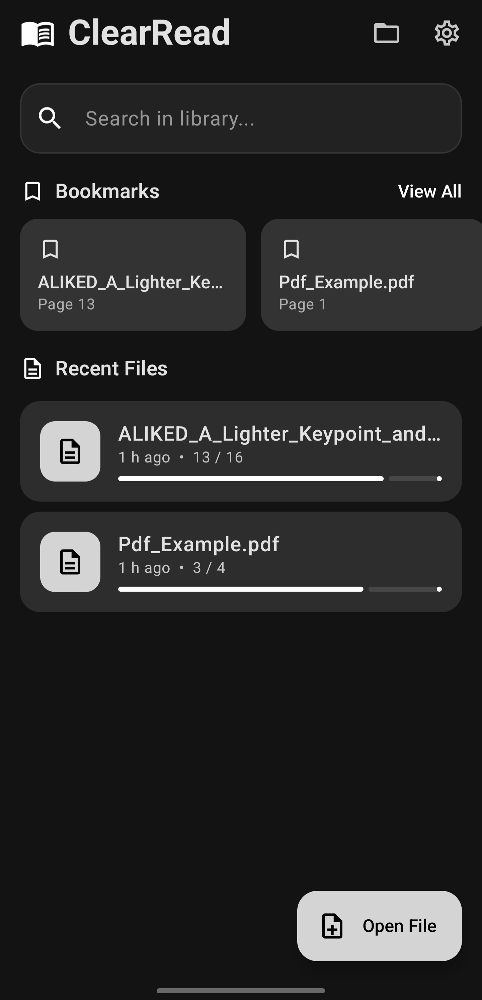
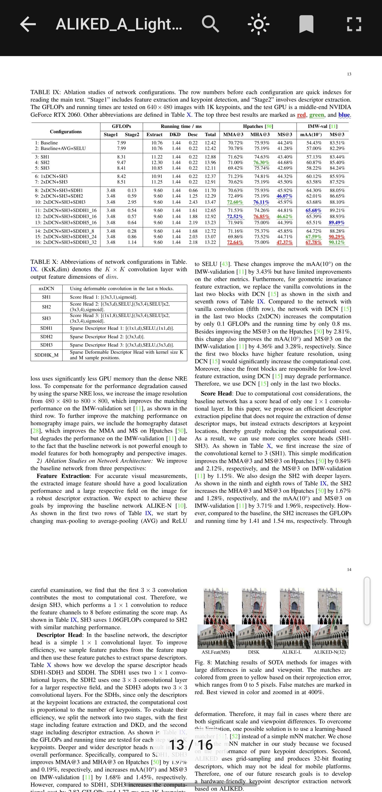
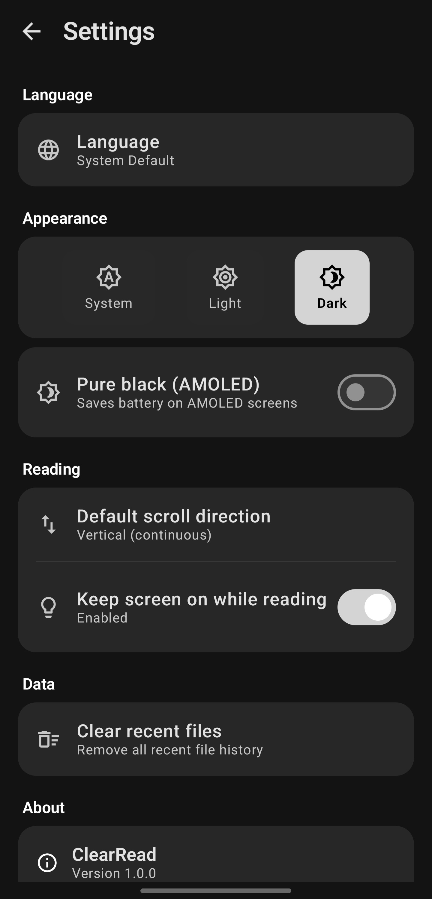

# ClearRead 📖

<p align="center">
  
</p>

<p align="center">
  <strong>A clean, ad-free, lightweight PDF reader for Android</strong>
</p>

<p align="center">
  <em>"Because privacy shouldn't be a premium feature, and reading shouldn't be a struggle."</em>
</p>

<p align="center">
    
    
    
</p>

---

## ✨ Features & Value Pillars

*   🛡️ **Complete Privacy:** Zero data collection, zero trackers, and no internet permission required. Your files stay 100% on your device.
*   ⚡ **Performance First:** Optimized specifically for low-end devices (4GB RAM phones) with fast rendering and minimal resource usage.
*   🎨 **Modern UX:** Features Material You dynamic theming and True AMOLED Dark Mode to save battery and reduce eye strain.
*   🔍 **Core Reading Tools:** Includes intelligent searching, smart bookmarks, and a built-in file explorer for effortless PDF management.

---

## 📸 Screenshots

<p align="center">
   |
   |
  
</p>

---

## 🤔 Why ClearRead? (My Commitment)

I built ClearRead because I was tired of seeing my family struggle with bloated, ad-filled PDF readers on their budget phones. Every app I tried was either:

*   🚫 Loaded with intrusive ads and endless subscriptions.
*   👻 Asking for sketchy permissions it never uses.
*   🐢 Slow and laggy on low-end devices.
*   📡 Tracking user behavior without transparency.

So, I decided to build what should have existed from the start: **a PDF reader that just works, respects your privacy, and runs fast on any device.** No ads. No trackers. Simple.

---

## 🌍 Privacy Pledge

ClearRead collects **zero data**. This is not a feature; it's my fundamental guarantee to you.

*   ❌ No analytics or crash reporting
*   ❌ Zero ad networks or third-party trackers
*   ❌ No internet permission needed (runs completely offline)
✅ **All your files and settings are handled exclusively on your device storage.**

---

## 📥 Download & Get Started


<p align=>Get the app today via Google Play or build it yourself for advanced use.</p>

**For Developers:** See the detailed setup instructions in the "Build from Source" section below!

---

## 🔬 Technical Architecture & Philosophy

ClearRead is built with modern Android development standards, focusing strictly on maintainability and performance.

*   **Language:** Kotlin
*   **UI:** Jetpack Compose — Chosen for its declarative nature, which minimizes boilerplate and ensures fluid rendering even on budget devices.
*   **Architecture:** MVVM + Repository Pattern — Ensures a Single Source of Truth (SSOT), keeping business logic isolated and testable.
*   **Database:** Room (SQLite) — A secure, local-only database for all user data. **Your private settings never leave your phone.**
*   **PDF Rendering:** AndroidPdfViewer (Pdfium) & PDFBox — Selected specifically for their industry-leading low memory footprint when handling large documents efficiently.

---

**Requirements:**
*   Android Studio Ladybug or later
*   JDK 17+
*   Android SDK 26+ (supports Android 8.0 Oreo and above)

---

## 🐛 Found a Bug? (Reporting Issues)

I want to make ClearRead the best it can be. If you encounter a crash, a rendering issue, or have a feature idea, please let me know! 

To help me fix it faster, please include:
1. **Device Model:** (e.g., Samsung S24 Ultra)
2. **Android Version:** (e.g., Android 14)
3. **The Issue:** What happened? What did you expect to happen?
4. **Steps to Reproduce:** How can I see the bug myself?

👉 **[Open an Issue](https://github.com/Namikkemal/clearread/issues/new)**

---

### ⚙️ Build from Source Instructions

To compile ClearRead on your local machine, follow these steps using a command-line interface (Terminal/Command Prompt):

1.  **Clone the Repository:**
    ```bash
    git clone https://github.com/Namikkemal/clearread.git
    ```
2.  **Enter Directory:**
    ```bash
    cd clearread
    ```
3.  **Run the Build Command:** This command compiles a release-ready APK file.
    ```bash
    ./gradlew assembleRelease 
    ```
4.  **Locate Output:** The finished APK will be found here: `app/build/outputs/apk/release/`

---

## 📜 License

This project is licensed under the **MIT License** - see the [LICENSE](LICENSE) file for details.
